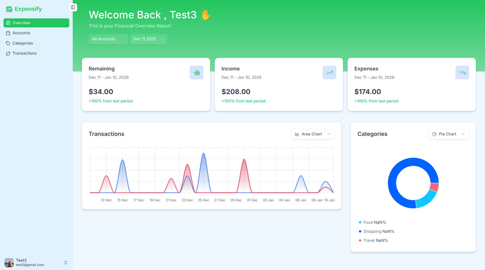
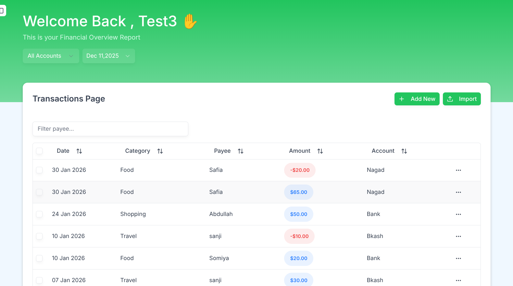

# Expense Tracker SaaS

A modern, full-stack expense tracking application built with Next.js 14, featuring real-time data visualization and secure user authentication.

## 🚀 Live Demo

[View Live Application](https://expensify-soft.vercel.app/)

## 📋 Features

- **User Authentication** - Secure sign-up/sign-in with session management
- **Account Management** - Multiple account support with real-time balance tracking
- **Transaction Tracking** - Add, edit, and categorize income/expense transactions
- **Data Visualization** - Interactive charts (Area, Bar, Line) showing financial trends
- **Category Management** - Custom categories with spending breakdown
- **Responsive Design** - Mobile-first approach with modern UI/UX
- **Real-time Updates** - Live data synchronization across components

## 🛠️ Tech Stack

**Frontend:**
- Next.js 14 (App Router)
- TypeScript
- Tailwind CSS
- Recharts (Data Visualization)
- React Query (State Management)
- Shadcn/ui (Component Library)

**Backend:**
- Next.js API Routes
- Prisma ORM
- PostgreSQL/SQLite
- Hono.js (API Framework)
- Zod (Schema Validation)

**Authentication & Security:**
- NextAuth.js
- Session-based authentication
- Input validation and sanitization

## 🏗️ Architecture

```
├── src/
│   ├── app/                 # Next.js App Router
│   │   ├── (auth)/         # Authentication pages
│   │   ├── (dashboard)/    # Protected dashboard routes
│   │   └── api/            # API endpoints
│   ├── components/         # Reusable UI components
│   ├── lib/               # Utilities and configurations
│   └── features/          # Feature-based modules
├── prisma/                # Database schema and migrations
└── public/               # Static assets
```

## 🚀 Getting Started

1. **Clone the repository**
   ```bash
   git clone https://github.com/somiyaakter/Expense-Tracker-SaaS.git
   cd expense-tracker-saas
   ```

2. **Install dependencies**
   ```bash
   pnpm install
   ```

3. **Set up environment variables**
   ```bash
   cp .env.example .env.local
   # DATABASE_URL=
   # BETTER_AUTH_SECRET=
   # BETTER_AUTH_URL=
   # NEXT_PUBLIC_APP_URL=

   ```

4. **Set up the database**
   ```bash
   npx prisma generate
   npx prisma db push
   ```

5. **Run the development server**
   ```bash
   npm run dev
   ```

6. **Open [http://localhost:3000](http://localhost:3000)**

## 📊 Key Implementation Highlights

- **Type-Safe API**: Full TypeScript implementation with Zod validation
- **Optimistic Updates**: React Query for seamless user experience
- **Component Architecture**: Modular, reusable components with proper separation of concerns
- **Database Design**: Normalized schema with proper relationships and constraints
- **Performance**: Optimized queries, lazy loading, and efficient state management
- **Security**: Input validation, SQL injection prevention, and secure authentication

## 🎯 Skills Demonstrated

- **Full-Stack Development**: End-to-end application development
- **Modern React Patterns**: Hooks, Context, Custom hooks, and Server Components
- **Database Management**: Schema design, migrations, and query optimization
- **API Development**: RESTful APIs with proper error handling and validation
- **State Management**: Complex state handling with React Query
- **UI/UX Design**: Responsive design with modern component libraries
- **TypeScript**: Advanced type safety and developer experience

## 📱 Screenshots

## Dashboard


## Transactions


## 🔧 Available Scripts

```bash
npm run dev          # Start development server
npm run build        # Build for production
npm run start        # Start production server
npm run lint         # Run ESLint
npm run type-check   # TypeScript type checking
```

## 📈 Future Enhancements

- [ ] Payment Gateway Implementation
- [ ] Advanced analytics and reporting
- [ ] Budget planning and alerts
- [ ] Multi-currency support
- [ ] Data export functionality

## 👨‍💻 Developer

**Your Name**
- Portfolio: [Coming Soon](your-portfolio-url)
- LinkedIn: [Coming Soon](your-linkedin-url)
- Email: somiyaakterrimo2021@gmail.com
